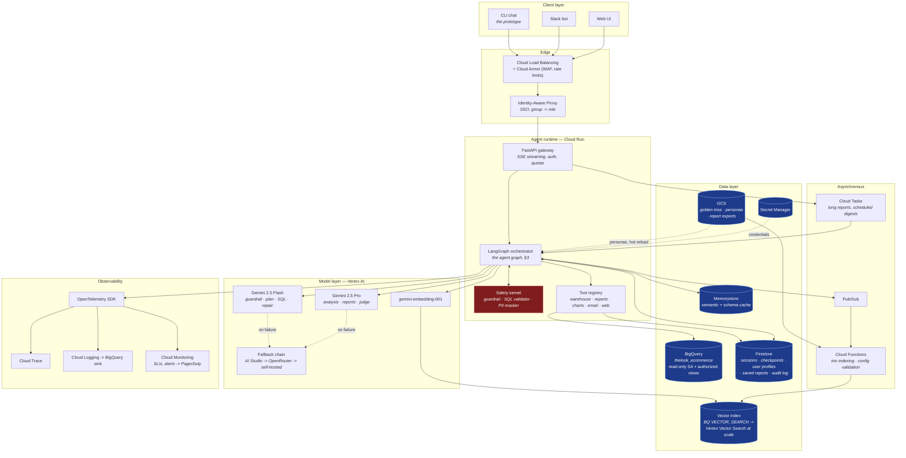
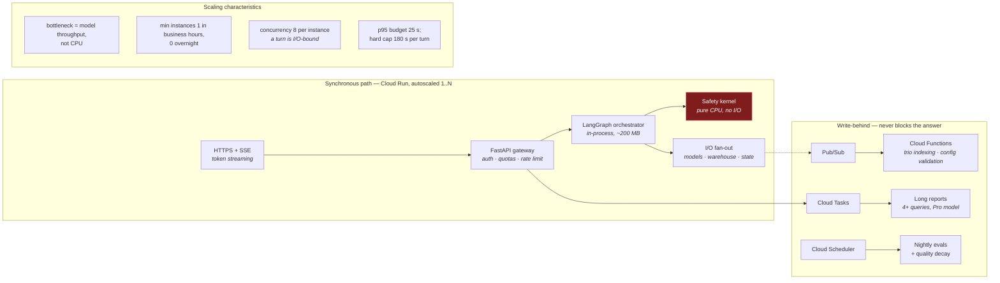
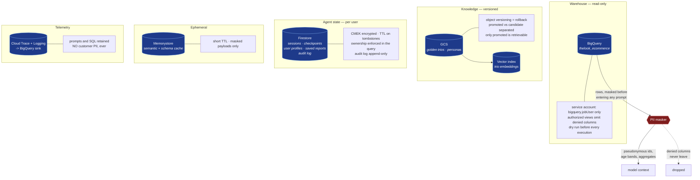
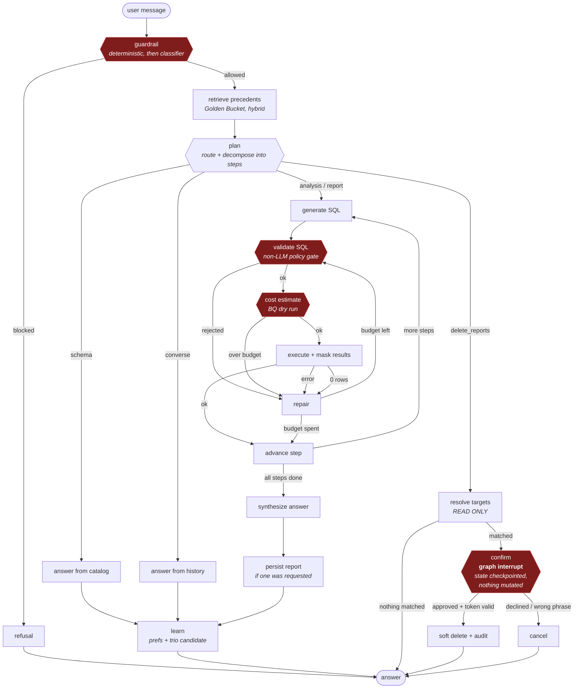
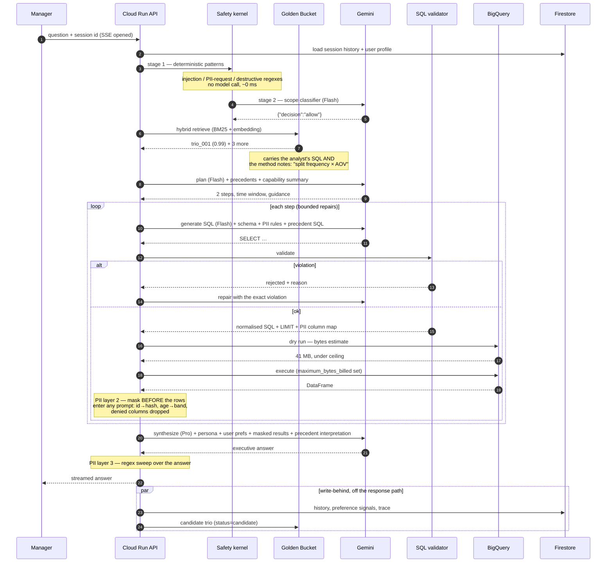
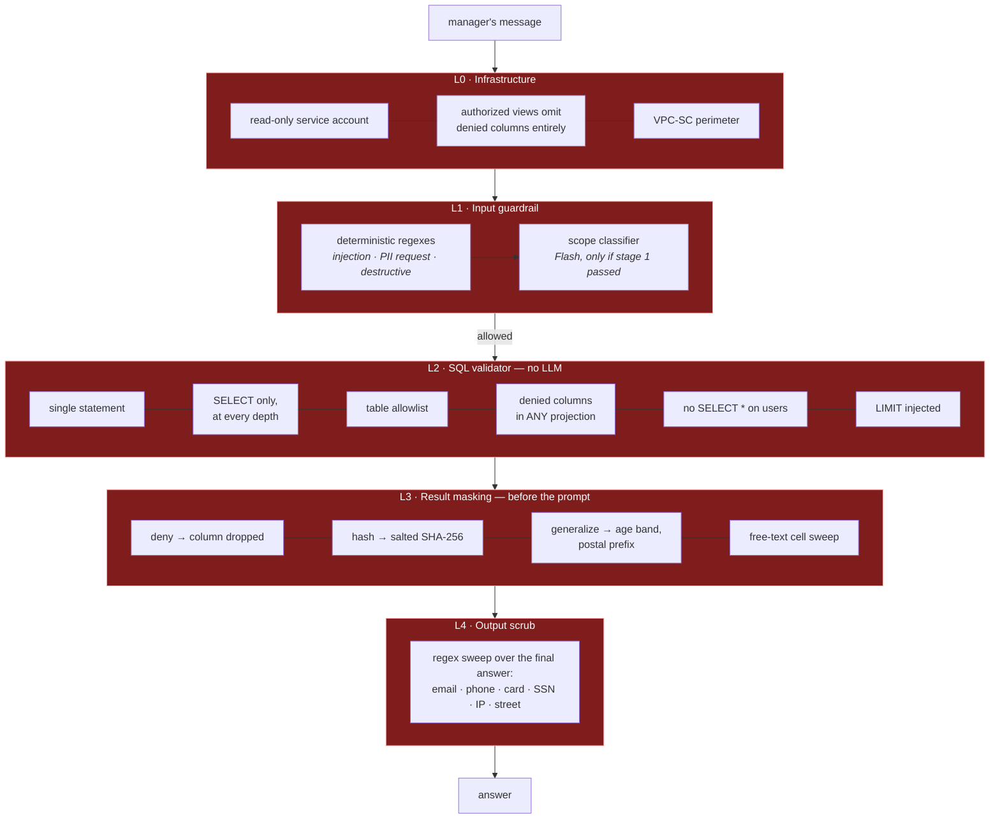

# Architecture Diagram

The system at a glance. Each diagram below answers one of the questions the brief asks:
**what services, what talks to what, what compute runs where, and where the data lives.**

The reasoning behind every choice — why LangGraph, why Gemini tiered, why BigQuery
`VECTOR_SEARCH` before Vertex AI Vector Search — is in
**[the design document](HLD.md)**, which also carries six further diagrams covering
retrieval, the learning loops, failover and the evaluation pyramid.

| # | Diagram | Question it answers |
|---|---|---|
| 1 | [System architecture](#1-system-architecture) | What services, and how do they communicate? |
| 2 | [Compute and request path](#2-compute-and-request-path) | What compute runs where, and how does it scale? |
| 3 | [Where the data lives](#3-where-the-data-lives) | How and where is data stored and handled? |
| 4 | [The agent graph](#4-the-agent-graph) | What is the control flow inside a turn? |
| 5 | [Anatomy of a turn](#5-anatomy-of-a-turn) | What is the end-to-end data flow? |
| 6 | [Safety enforcement points](#6-safety-enforcement-points) | Where is policy actually enforced? |

---

## 1. System architecture

Building blocks, services and the communication between them. Red is the safety kernel;
blue is persistent storage.

Detail: [HLD §2](HLD.md#2-system-architecture) · [service choices](HLD.md#5-technology-choices-and-why)

---

## 2. Compute and request path

What actually runs, on what, and what happens when it scales. Everything on the synchronous
path is one Cloud Run container; the write-behind work is deliberately off it.

A turn is almost entirely waiting on the model, so instances carry high concurrency and the
cost driver is inference, not compute. Detail: [HLD §16](HLD.md#16-cost-scale-and-security-posture).

---

## 3. Where the data lives

Every class of data, its store, and how it is protected. Nothing personal ever reaches a
model context, a log, or a trace.

The masker sits between the warehouse and the prompt, not between the model and the user —
which is what makes prompt injection unable to exfiltrate data the model never received.
Detail: [HLD §7](HLD.md#7-safety-and-pii).

---

## 4. The agent graph

Control flow inside one turn. The SQL repair cycle is real graph edges, so every attempt is
independently traced and resumable. Red nodes are gates — three deterministic, one human.

Detail: [HLD §3](HLD.md#3-the-agent-graph) · [resilience](HLD.md#10-resilience-and-error-handling)

---

## 5. Anatomy of a turn

End-to-end data flow for *"Why are customers in Texas underspending compared to
California?"* — including where masking happens and what is written behind.

Detail: [HLD §4](HLD.md#4-anatomy-of-a-turn-data-flow)

---

## 6. Safety enforcement points

Five layers, each assuming the ones above it have failed. Only L1 involves a model.

Detail: [HLD §7](HLD.md#7-safety-and-pii) · [threat model](HLD.md#threat-model)

---

## Further diagrams

The design document carries six more: the hybrid retrieval pipeline and the Golden Bucket
update loop ([§6](HLD.md#6-hybrid-intelligence--the-golden-bucket)), the destructive-op
confirmation protocol ([§8](HLD.md#8-high-stakes-oversight--destructive-operations)), the
preference confidence ramp ([§9.1](HLD.md#91-user-level)), model and provider failover
([§10.3](HLD.md#103-third-party-failures)), the evaluation pyramid
([§11.1](HLD.md#111-the-evaluation-pyramid)), and the persona hot-reload path
([§13](HLD.md#13-agility--persona-management)).
