# Retail Insight Agent — High-Level Design

An internal data-analysis agent for Store and Regional Managers. It answers questions
about sales, inventory and customer behaviour in natural language, writes executive
reports, and manages a library of saved reports — over a read-only BigQuery warehouse
containing raw transaction logs with personal data in them.

This document is the production design. The repository contains a working prototype of
it; [§13](#13-what-the-prototype-implements) maps one to the other.

---

## Table of contents

1. [Design principles](#1-design-principles)
2. [System architecture](#2-system-architecture)
3. [The agent graph](#3-the-agent-graph)
4. [Anatomy of a turn](#4-anatomy-of-a-turn-data-flow)
5. [Technology choices and why](#5-technology-choices-and-why)
6. [Hybrid intelligence — the Golden Bucket](#6-hybrid-intelligence--the-golden-bucket)
7. [Safety and PII](#7-safety-and-pii)
8. [High-stakes oversight — destructive operations](#8-high-stakes-oversight--destructive-operations)
9. [Continuous improvement — the learning loops](#9-continuous-improvement--the-learning-loops)
10. [Resilience and error handling](#10-resilience-and-error-handling)
11. [Quality assurance](#11-quality-assurance)
12. [Observability](#12-observability)
13. [Agility — persona management](#13-agility--persona-management)
14. [Extensibility](#14-extensibility)
15. [What the prototype implements](#15-what-the-prototype-implements)
16. [Cost, scale and security posture](#16-cost-scale-and-security-posture)

---

## 1. Design principles

Five decisions shape everything below. They are worth stating up front because most of
the specific choices are consequences of them.

**1. The model is a planner, not a gatekeeper.**
Every control that actually matters — what SQL may run, which columns may leave the
warehouse, what gets deleted — is enforced by deterministic code the model cannot talk
its way past. Prompts express *intent*; validators express *policy*. A jailbreak that
fully captures the model still cannot select `users.last_name`, because the SQL
validator rejects the statement before the warehouse ever sees it.

**2. Move the trust boundary, don't guard it.**
The most reliable way to stop the agent leaking PII is to never put PII in its context.
Results are masked in the DataFrame *before* they are serialised into a prompt. There is
no prompt-injection payload that extracts a value the model was never shown.

**3. Failure is a state, not an exception.**
An empty result set, a syntax error, a dead LLM provider and an exhausted budget are all
modelled as states in the graph with defined transitions. The turn always terminates in
an answer — sometimes a partial or degraded one, stated honestly. The user never sees a
traceback and never sees a fabricated number.

**4. Bounded everything.**
Self-correction is the most expensive failure mode an agent has: a loop that retries a
broken query forever turns a bug into an invoice. Repair attempts, LLM calls per turn,
bytes scanned per query and per turn, and wall-clock time are all hard-capped, and the
caps are configuration rather than code.

**5. Non-developers own the parts that change weekly.**
Tone, report structure, PII classification and cost ceilings live in versioned YAML
edited by the teams that own those decisions — the CEO's office, data governance,
finance — and take effect on the next turn without a deploy.

---

## 2. System architecture

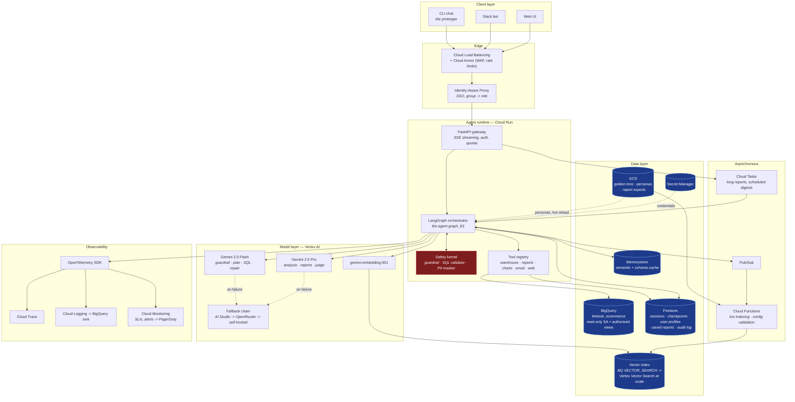

### Component responsibilities

| Component | Responsibility | Why this service |
|---|---|---|
| **Cloud Run** | Hosts the FastAPI gateway and the LangGraph orchestrator in one container | Request-scoped autoscaling, scale-to-near-zero between business hours, native SSE streaming for token-by-token output, and a 60-minute request ceiling that covers even a four-step report. GKE would add cluster management for no benefit at this scale; Cloud Functions cannot hold a streaming connection long enough. |
| **Cloud Armor + IAP** | WAF, per-identity rate limits, SSO | Managers authenticate with their corporate identity; IAP maps Google Groups to roles (`viewer`, `manager`, `admin`). The agent never implements its own auth. |
| **Firestore** | Sessions, LangGraph checkpoints, user profiles, saved reports, audit log | The access pattern is point reads by `user_id`/`session_id` and small ordered lists — exactly Firestore's shape. Serverless, single-digit-ms reads, and native TTL for the soft-delete retention window. Cloud SQL would be the choice if reports needed relational joins; they do not. |
| **BigQuery** | The warehouse | Given. Accessed through a service account with `roles/bigquery.dataViewer` only, and through authorized views that do not expose denied columns at all — so the SQL validator is a second line of defence, not the only one. |
| **GCS** | Golden trios, persona files, exported reports | Object versioning gives free rollback for personas and an audit trail for knowledge-base edits. Object-finalize events drive re-indexing. |
| **Vector index** | Semantic retrieval over the Golden Bucket | Start on **BigQuery `VECTOR_SEARCH`**: the trio corpus is thousands of rows, the embeddings can live in a column next to the metadata, and it adds no new infrastructure or cost floor. Migrate to **Vertex AI Vector Search** when the corpus passes ~10⁵ vectors or p95 retrieval exceeds ~150 ms. |
| **Memorystore (Redis)** | Semantic answer cache, schema cache, rate-limit counters | "What was revenue last month?" is asked by thirty managers on the first of the month. A normalised-question cache with a short TTL removes most of that cost. |
| **Vertex AI** | Gemini models and embeddings | See [§5](#5-technology-choices-and-why). |
| **Pub/Sub + Cloud Functions** | Trio indexing, config validation, eval triggers | Keeps the write-behind learning loop off the request path entirely. |
| **Cloud Tasks** | Long report generation, scheduled digests | A "full Q1 report" with four queries and a Pro-model write-up can exceed a comfortable interactive latency; the API returns a task id and streams the result when ready. |

---

## 3. The agent graph

The orchestrator is a **LangGraph** state machine. The SQL self-correction cycle is
expressed as real graph edges rather than a loop inside a node, which buys three things:
every attempt is an independently traced span, the repair budget is inspectable state
rather than a local variable, and a run can be resumed from a checkpoint mid-repair.

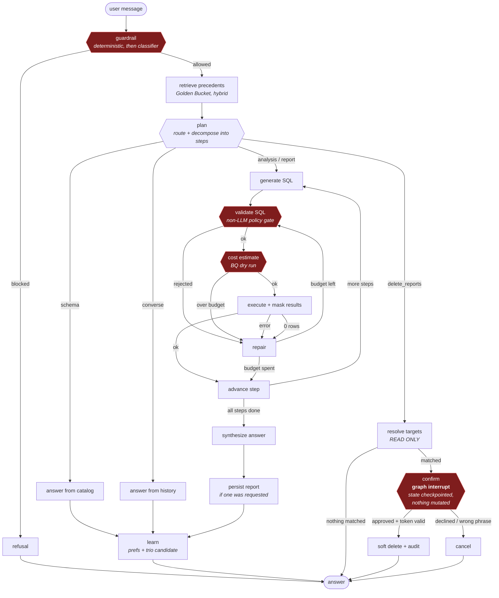

Red nodes are the four gates. Three of them (`guardrail` stage 1, `validate SQL`,
`cost estimate`) are pure deterministic code. The fourth is a human.

---

## 4. Anatomy of a turn (data flow)

Tracing *"Why are customers in Texas underspending compared to California?"* end to end:

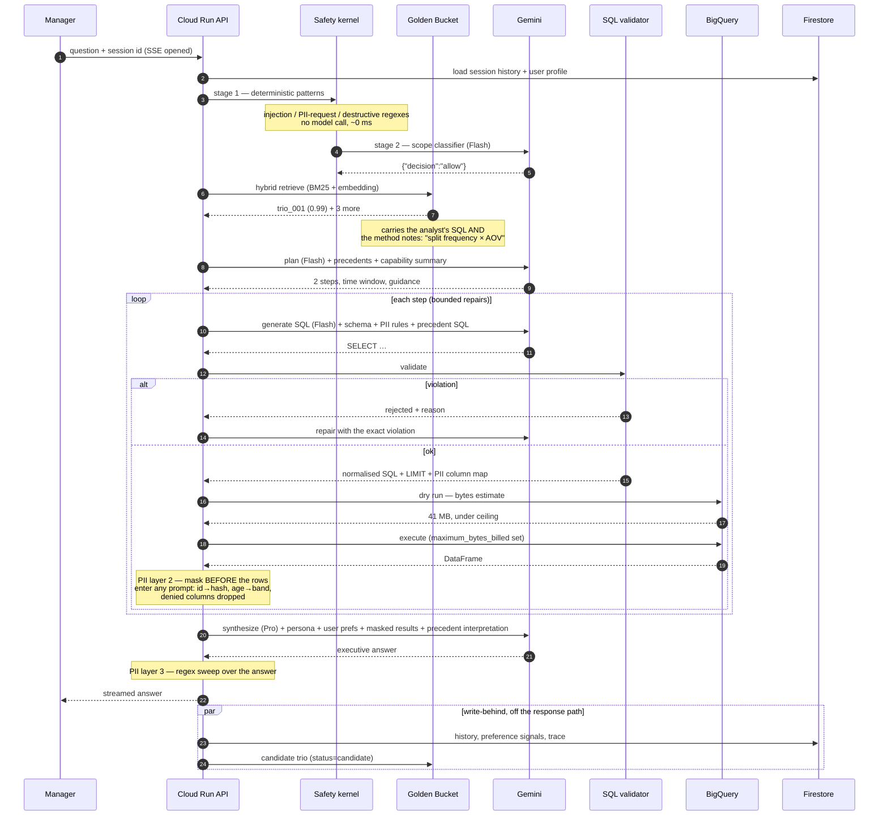

The single most important arrow is the `Note over API` after execution. Masking happens
between the warehouse and the prompt, not between the model and the user.

---

## 5. Technology choices and why

### Orchestration: LangGraph

The requirements include a bounded retry cycle, a mid-run human approval that must
survive a process restart, and multi-step plans. That is a **state machine with
checkpoints**, and LangGraph is the smallest framework that models exactly that.

- Cyclic graphs are first-class, so `validate → repair → validate` is an edge, not a
  `while` loop hidden inside a tool.
- `interrupt()` + a durable checkpointer is precisely the destructive-op requirement:
  the graph suspends, state persists, and execution resumes only with an explicit
  decision. Building this on a plain agent loop means inventing a pending-action table
  and a resume protocol by hand.
- State is an explicit typed dict, so every field a node reads is visible — which is
  what makes a trace sufficient to reconstruct a turn.

*Alternatives considered.* A ReAct-style tool-calling loop (plain LangChain, or the raw
model's function calling) is simpler, but it makes control flow a property of model
output — the deletion gate would then depend on the model choosing to ask. CrewAI /
AutoGen optimise for multi-agent conversation, which is not the problem here. A
hand-rolled state machine is viable and was the fallback plan; LangGraph's checkpointing
and streaming are worth the dependency.

### Models: Gemini on Vertex AI, tiered

| Stage | Model | Why |
|---|---|---|
| Guardrail stage 2, planning, SQL generation, SQL repair, preference extraction | **Gemini Flash** (`gemini-3.7-flash`) | High call volume, structured JSON or SQL output, latency-sensitive. Flash is roughly an order of magnitude cheaper than Pro and the task is well-specified enough that the gap in reasoning quality does not show. |
| Analysis, report writing, LLM-as-judge | **Gemini Pro** (`gemini-pro-latest`) | Once per turn, and it is the entire perceived quality of the product. Causal interpretation ("frequency gap, not basket gap") is exactly where the stronger model earns its cost. |
| Embeddings | **gemini-embedding-001** | 3072-dim, task-typed (`RETRIEVAL_QUERY` vs `RETRIEVAL_DOCUMENT`), same vendor and IAM boundary. |

**Vertex AI rather than the AI Studio endpoint** for production: VPC Service Controls,
CMEK, data residency, a contractual no-training guarantee, provisioned throughput to
escape shared rate limits, and IAM instead of a long-lived API key. The prototype uses
the AI Studio key because it is free and needs no GCP project. Note that the AI Studio
**free tier grants no Pro request quota** (`gemini-pro-latest` returns 429
`GenerateRequestsPerDayPerProject`), so the shipped default runs the analyst node on
Flash too; on a billed project or Vertex AI it is a one-line change in
`config/settings.yaml`.

The router is provider-agnostic and walks a configured chain
(`Vertex → AI Studio → OpenRouter → self-hosted Ollama`). Call sites request a
*purpose* and a *tier*, never a model name, so re-tiering is a YAML edit.

### Warehouse access

BigQuery via a service account holding `roles/bigquery.dataViewer` on the dataset and
`jobUser` on a dedicated project, so cost is attributable per agent. Every query carries
`maximum_bytes_billed` and a `labels={"app": "retail-insight-agent"}` tag for
per-feature cost breakdown. A dry run precedes every execution, so cost is known before
it is incurred rather than discovered on the invoice.

---

## 6. Hybrid intelligence — the Golden Bucket

> *Requirement: the agent must use historical Trios to understand how analysts
> previously interpreted questions. Explain how the bucket is updated over time and how
> relevant data is provided at query time.*

### What a Trio actually carries

A Trio is `question → SQL → analyst report`, plus one field that is not in the original
specification and does most of the work: **`analyst_method_notes`** — the transferable
judgement, separated from the specific answer.

```json
{
  "trio_id": "trio_001",
  "question": "Why are customers in Texas underspending compared to California?",
  "intent_tags": ["cohort_comparison", "geography", "root_cause"],
  "sql": "WITH customer_spend AS (…) SELECT state, AVG(revenue) …",
  "analyst_report": "The gap is a *frequency* gap, not a basket-size gap …",
  "analyst_method_notes": [
    "ALWAYS exclude status IN ('Cancelled','Returned') from revenue.",
    "Decompose per-customer revenue into frequency × AOV before attributing a cause.",
    "Normalise by customer count — raw state totals just measure population size."
  ],
  "quality_score": 0.95,
  "status": "promoted",
  "used_count": 41
}
```

The report tells the model *what a good answer to this question looked like*. The method
notes tell it *what rule to apply to a question it has never seen*. Retrieval that
returns only the SQL produces an agent that copies queries; retrieval that returns the
method produces one that reasons like the analyst.

### Retrieval at query time

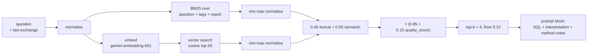

Four details matter:

1. **Hybrid, not pure vector.** Retail questions turn on exact vocabulary — `AOV`,
   `churn`, a category name, a state. Embeddings blur exactly those tokens; BM25 nails
   them. Conversely a paraphrase like *"why are people in Texas buying less often"* has
   almost no lexical overlap with the stored question and is found only by the dense leg.
2. **Per-leg min-max normalisation before the weighted sum.** BM25 is unbounded and
   cosine is in [-1, 1]; summing raw scores silently lets BM25 dominate every ranking.
3. **Quality as a mild multiplier, not a filter.** At comparable relevance a trio the
   analysts rated 0.95 is a better precedent than one rated 0.6, but relevance still
   dominates — a highly-rated trio about churn must not out-rank a relevant one about
   margin.
4. **The last exchange is appended to the retrieval query.** A terse follow-up
   (*"and Texas?"*) carries no retrievable signal on its own.

Retrieved precedents are injected into **two** prompts, doing different jobs: the SQL
generator receives the precedent *SQL* (join structure, filters, metric definitions), and
the analyst stage receives the precedent *interpretation and method notes*.

### How the bucket is updated over time

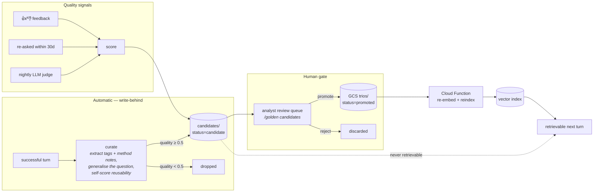

**The human gate is the point.** An agent that promotes its own output into its own
retrieval corpus will amplify its own mistakes — a confidently wrong answer becomes a
precedent, which produces more confidently wrong answers. Candidates are written
automatically and cheaply; only a human analyst moves one to `promoted`, and only
`promoted` trios are retrievable.

Three other update paths: analysts author trios directly (the original seeding
mechanism); a 👎 on an answer whose question matches a promoted trio flags that trio for
re-review; and a nightly job decays `quality_score` for trios that have not been
retrieved in 90 days so the corpus does not accumulate dead weight.

---

## 7. Safety and PII

> *Requirement: only answer analysis questions, be safeguarded against malicious users,
> and never display PII in the final output.*

Five layers. Each assumes the ones above it have already failed.

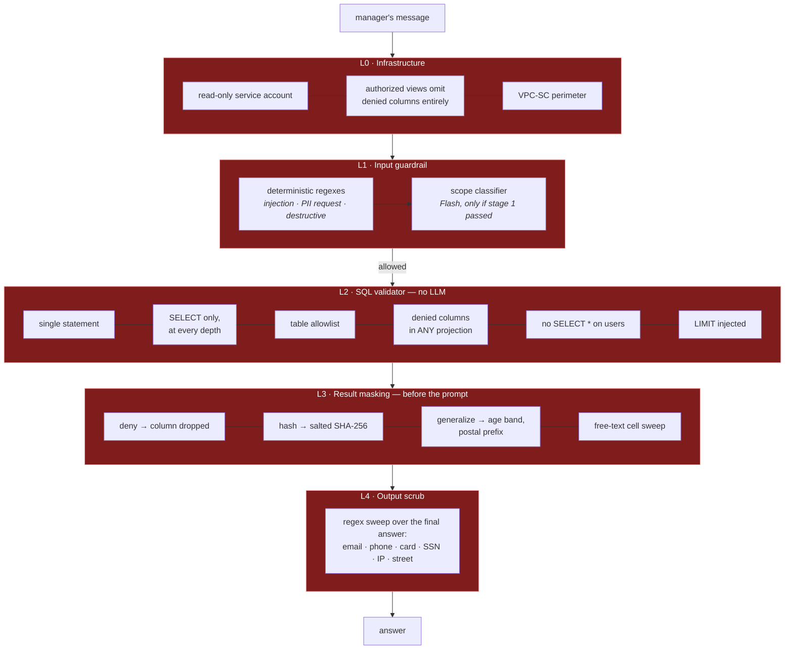

### L1 — input guardrail

Stage 1 is ~30 compiled regexes covering instruction override, system-prompt extraction,
persona hijack, control-bypass, natural-language and literal destructive SQL, and PII
extraction phrasings. It costs nothing, cannot be paraphrased around by a model that
never sees it, and — critically — **runs before any model call**, so an attack does not
even consume budget.

Stage 2 is a Flash classifier that decides *scope*, not safety. This split is deliberate:
a classifier is exactly the wrong place to put a control an attacker can address in
natural language. If the classifier is unreachable the guardrail **fails open on scope**
and closed on everything else — stage 1 has already run, and L2/L3 still stand.

One subtlety the prototype gets right: *"delete all the reports we made in this
conversation"* is a legitimate, supported action, while *"delete all the rows in orders"*
is not. The destructive rules are suppressed when the object of the verb is a report.

### L2 — the SQL validator

The statement is parsed into a **sqlglot AST** and checked structurally, never by string
matching. Substring checks are trivially defeated (`/**/`, unicode, casing, nesting);
an AST is not. Checks: exactly one statement; a read at the root; no write node at any
depth; every table on the allowlist; **no denied PII column in any projection at any
nesting level** (a `last_name` hidden inside a CTE and aliased in the outer select is
caught); no `SELECT *` against `users`; a `LIMIT` injected if absent.

The validator also returns the map from each output column to the PII action to apply
after execution — so L2 and L3 cannot drift apart.

PII columns used as *filters* (`WHERE last_name = 'Smith'`) are permitted but recorded in
the audit log, because filtering is a legitimate analytical need and blocking projection
is the control that matters.

### L3 — result masking, before the prompt

This is the layer that makes the others redundant rather than load-bearing. Policy from
`config/pii_policy.yaml`, owned by Data Governance:

| Action | Effect | Rationale |
|---|---|---|
| `deny` | Column never leaves the warehouse; SQL selecting it is rejected | Names, street addresses, coordinates have no analytical value |
| `hash` | Salted SHA-256, truncated → `cust_a41f9c` | Keeps rows joinable and referenceable ("`cust_a41f9c` spent $4,120") without being re-identifiable |
| `generalize` | `age` → `30-39`, `postal_code` → `945**` | Preserves segmentation value, defeats singling-out |
| `allow` | Untouched | State, city, category, timestamps |

Because this happens on the DataFrame before serialisation, **the model physically never
receives an unmasked value**. Prompt injection cannot exfiltrate what is not there.

### L4 — output scrub

A final regex sweep over the generated answer catches PII that arrived through a
free-text column or that the model reconstructed. It is cheap and it is the layer that
covers the unknown-unknowns.

### Threat model

| Threat | Primary control | If it fails |
|---|---|---|
| Prompt injection to dump PII | L1 stage 1 | L2 rejects the SQL; L3 means there is nothing to dump |
| Injection via *data* (a malicious product name) | L3 cell sweep | L4 output scrub |
| Data exfiltration through a crafted query | L2 AST validation | L3 masking; BQ authorized views (L0) |
| Warehouse mutation | L0 read-only SA | L1 + L2 both reject writes |
| Cost attack (expensive query loop) | Dry-run gate + `maximum_bytes_billed` | Per-turn byte and call budgets |
| Re-identification by repeated narrow filters | Audit log on PII filters | Anomaly alert on filter-column usage rate |
| Malicious deletion of another user's reports | Ownership enforced in the SQL `WHERE` | Token binding + audit + soft delete |

---

## 8. High-stakes oversight — destructive operations

> *Requirement: support "Delete all reports mentioning Client X" / "Delete all the reports
> we made in this conversation" with a strict confirmation flow that does not break UX.*

The design principle: **the model proposes a target set; it never executes one.**
Deletion is a two-phase protocol with a graph interrupt between the phases.

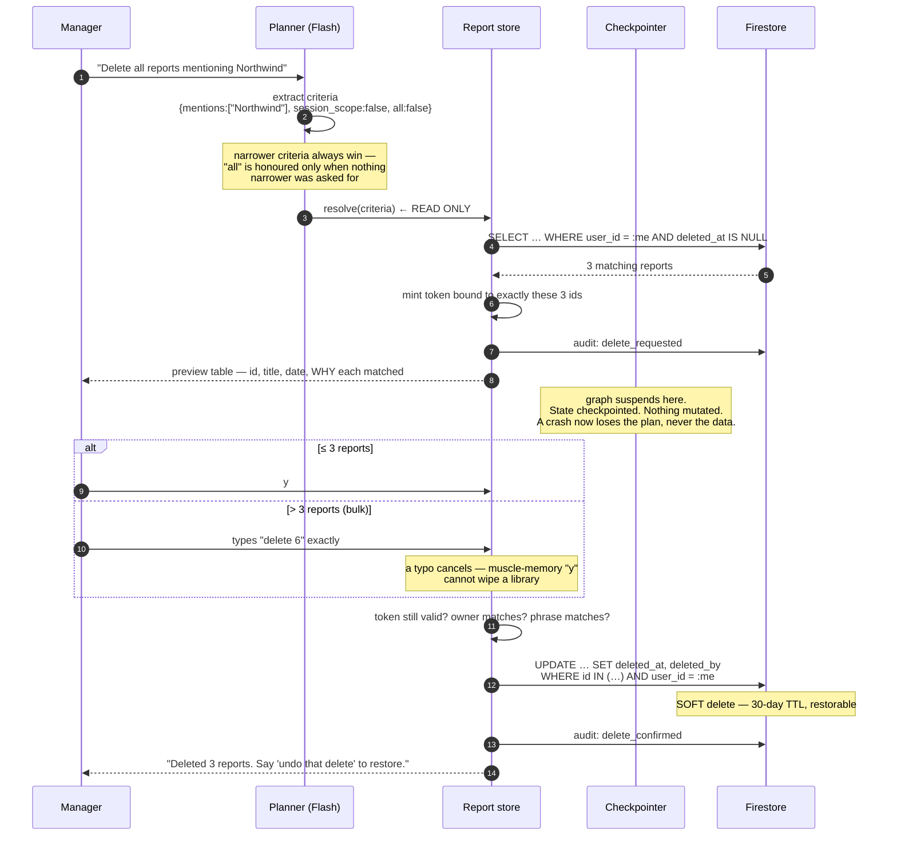

### Why each piece is there

- **Resolve is read-only and shows its work.** The preview names each report *and why it
  matched* — `mentions northwind`, `created in this conversation`. Ambiguity surfaces
  before the destructive step, not after.
- **The token is minted from the resolved id set.** Approval applies to *those* reports.
  A token cannot be replayed, cannot be used by another user, and cannot approve a set
  that has since changed.
- **Ownership is in the `WHERE` clause**, re-checked at execution, not just at
  resolution. It is not a prompt instruction.
- **Under-specification selects nothing.** A criteria object with no positive matcher
  returns an empty set and the agent asks which reports were meant. "Delete my reports"
  with no qualifier must never resolve to "everything" by accident.
- **Graduated friction preserves UX.** One or two reports: a `y/N`. More than three: type
  `delete 6` exactly. Routine actions stay one keystroke; irreversible ones cost a
  sentence. This is the "without breaking UX" requirement — friction proportional to
  blast radius, not applied uniformly.
- **Soft delete with a 30-day window.** The confirmation flow is the *first* safety net;
  reversibility is the second, because a determined user can confirm a mistake.
- **Every phase is audited** — requested, cancelled, confirmed, restored — with actor,
  criteria, target ids and trace id.

---

## 9. Continuous improvement — the learning loops

### 9.1 User level

> *Requirement: remember that Manager A prefers tables while Manager B prefers bullet
> points, and learn depth/chart preferences over time.*

After every turn, a Flash call extracts preference signals against a **closed vocabulary**
(`output_format`, `analysis_depth`, `wants_charts`, `wants_action_items`,
`number_style`, `default_time_window`, `focus_metrics`, `preferred_comparison`). A closed
set stops an extractor inventing keys no prompt ever reads.

Signals carry a source, and the two behave very differently:

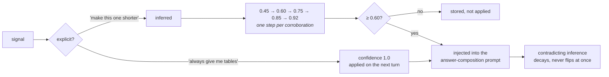

The ramp is the design. Acting on one ambiguous signal produces an agent that thrashes
between formats every time a manager says "shorter"; requiring corroboration produces one
that converges. An explicit statement always outranks a contradicting inference — if
someone *said* they want tables, one terse follow-up does not overrule it.

Every stored preference keeps the utterance that produced it, so `/prefs` can show
*"output_format: bullets — observed ×3 — 'just the bullets please'"*. A user can see why
the agent behaves as it does and reset it. Preferences are keyed by `user_id`, so
Manager A's tables and Manager B's bullet points never collide.

### 9.2 System level

Four mechanisms, in increasing order of autonomy:

1. **Candidate trios** ([§6](#how-the-bucket-is-updated-over-time)) — the agent proposes
   what it learned; a human decides whether it becomes knowledge.
2. **Failure mining.** Every trace with `sql.gave_up`, a guardrail block on a legitimate
   question, or a 👎 lands in a BigQuery table. A weekly job clusters them by error kind
   and by the schema entity involved. A recurring `not_found` on `products.brand`
   is not an agent bug — it is a missing line in the semantic layer, and that is a
   one-line fix to `schema_catalog.py` worth far more than prompt tinkering.
3. **Prompt and semantic-layer regression loop.** Failure clusters become new eval cases
   *first*, then a fix is attempted. The eval suite is what stops a fix for one class
   silently regressing another.
4. **Retrieval tuning.** Hybrid weights and the score floor are configuration. Nightly,
   the judge scores answers with and without retrieval on a held-out set; if precedents
   are not measurably improving grounding, the weights are wrong and are re-fit.

What is deliberately **not** automated: no online fine-tuning, and no self-promotion into
the retrieval corpus. Both create a feedback loop where the agent's errors become its
training signal, and both are extremely hard to roll back.

---

## 10. Resilience and error handling

> *Requirement: detect syntax errors and empty returns and self-correct before giving up,
> without crashing the UI and without inflating costs. Be resilient to third-party
> failures.*

### 10.1 SQL self-correction

Errors are classified, and the class selects the repair strategy — a generic "try again"
prompt is measurably worse than one that names the failure:

| Class | Detected from | Repair strategy | Repairable |
|---|---|---|---|
| `syntax` | Parser error / dry run | Point at the exact position; remind of BigQuery-specific forms (`DATE_TRUNC(DATE(x), MONTH)`) | yes |
| `not_found` | Unknown table/column | Re-ground in the schema; flag the classic `orders.amount` mistake — revenue lives on `order_items.sale_price` | yes |
| `type` | Type mismatch | Cast explicitly; `SAFE_DIVIDE` for ratios | yes |
| `grouping` | Aggregate/GROUP BY | Every non-aggregated column must appear in GROUP BY | yes |
| `ambiguous` | Ambiguous column | Qualify every column with its alias | yes |
| `rejected` | Our own validator | Feed back the exact violation; swap a PII column for a cohort attribute | yes |
| `empty` | 0 rows | **Widen once**: relax the narrowest filter, extend the range, `LOWER(col) LIKE '%x%'` instead of `=`. Never change what is measured | once |
| `cost` | Dry run over ceiling | Add a date filter, project fewer columns | yes |
| `permission` | 403 | **Not repairable** — surface it | no |
| `budget` | Our own ceiling | **Not repairable** — wind down and answer with what succeeded | no |

**Empty results are treated as a first-class outcome, not an error.** They are widened
exactly once, then reported honestly — *"the query ran and matched zero rows"* — because
some questions genuinely have an empty answer, and an agent that keeps loosening filters
until it finds *something* will eventually answer a different question than the one asked.

### 10.2 What stops the loop

Four independent brakes, so no single mis-estimate runs away:

1. `repair_budget_left` decrements per repair and is never refilled within a step.
2. Non-repairable classes skip the loop entirely.
3. `TurnBudget` caps LLM calls, bytes scanned and wall-clock time for the whole turn,
   independently of the per-step budget.
4. `maximum_bytes_billed` on the BigQuery job means the *warehouse* kills a query that
   escapes our estimate.

When the budget is spent, the step is marked failed and the answer is composed from
whatever succeeded, with the gap stated explicitly. The synthesis prompt is given
`"You do NOT have these figures. Say which part of the question you could not answer."`
— fabrication is a worse failure than an incomplete answer.

### 10.3 Third-party failures

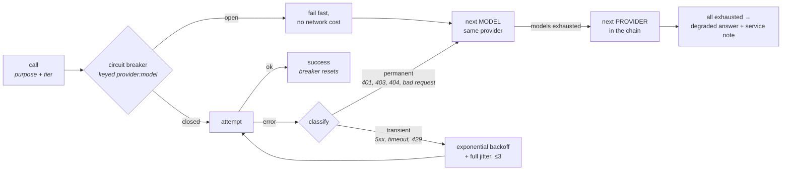

Three things are doing work here.

**Classification** matters commercially: retrying a `401` three times with backoff costs
latency and buys nothing, while a `503` almost always succeeds on retry.

**Failover is two-level — model first, then provider.** A model fails independently of its
provider far more often than the provider fails as a whole, and the second level is much
more expensive to reach (different vendor, different quality, possibly different price).
Two failure modes make this concrete, both observed repeatedly in practice:

- *Per-model overload.* Gemini returns `"This model is currently experiencing high demand"`
  for one model while its siblings serve normally in the same second.
- *Per-model quotas.* The AI Studio free tier meters
  `GenerateRequestsPerDayPerProjectPerModel`, so listing several models makes their daily
  allowances stack. The same shape applies to paid provisioned throughput, which is
  purchased per model.

Model lists are ordered strongest-first, so exhausting the head of the list degrades
answer quality gradually rather than dropping the turn.

**The circuit breaker is keyed `provider:model`**, not `provider`. Keying it per provider
would let one overloaded model open the breaker for its healthy siblings — turning a
partial outage into a total one. After three consecutive failures a key opens for 30 s and
the router skips it without a network round trip.

**Degradation ladder**, in order of preference:

| Failure | Behaviour |
|---|---|
| Gemini Pro unavailable | Analysis runs on Flash; answer is shorter, still grounded |
| All LLM providers unavailable | Guardrail stage 1 still runs; schema questions answered from the local catalog; analysis returns the retrieved figures with an explanation |
| Planner unavailable | Heuristic routing + single-step plan; turn marked `degraded` |
| Embedding service unavailable | Retrieval degrades to lexical-only BM25 |
| BigQuery unavailable | Cached answers served with an explicit staleness note; otherwise a clear "the warehouse is unreachable" |
| Firestore unavailable | Turn proceeds without history/preferences; write-behind is queued |

Every degraded turn sets `degraded_reason` and instructs the writer to say so in one
line. A silently degraded agent is worse than a visibly degraded one — the manager needs
to know whether to trust the number.

### 10.4 The outermost guarantee

`ChatSession.ask` wraps the entire graph invocation. Any exception that escapes every
inner handler is caught, counted as `turns.failed`, and rendered as a message carrying
the trace id. **The CLI can never print a traceback.**

---

## 11. Quality assurance

> *Requirement: how do you evaluate before deployment, verify that reports answer user
> intent, and evaluate UX?*

### 11.1 The evaluation pyramid

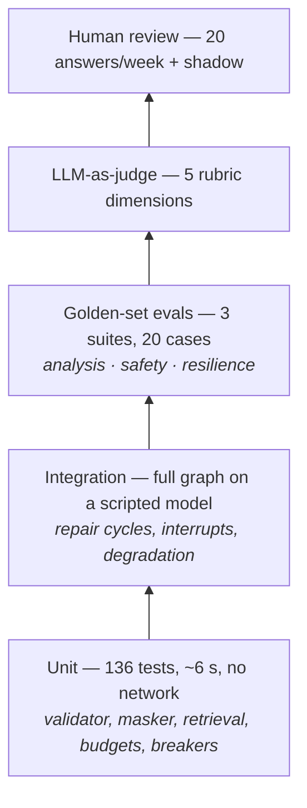

Everything below the judge runs with **no API key and no network**, which is what makes
it a merge gate rather than a nightly aspiration.

### 11.2 Does the answer match intent?

Intent match cannot be asserted with a string comparison, so it is triangulated:

1. **Structural assertions** (deterministic, in CI): correct route, SQL references the
   expected tables, no denied PII column, minimum row count, the expected precedent was
   retrieved, forbidden patterns absent from the answer.
2. **Execution-equivalence for SQL.** Generated SQL is compared to the reference SQL by
   *result*, not by text — run both, compare the frames on the shared columns. Many
   correct queries, one correct answer.
3. **LLM-as-judge** against a per-case rubric on five dimensions — `intent_match`,
   `grounding`, `actionability`, `clarity`, `safety`. `grounding` is scored against the
   *actual query results the model was given*, so an invented figure scores 1 and is
   detectable without a human.
4. **Multi-part intent.** The rubric for a compound question explicitly names both parts
   ("compares X and Y **and** explains the difference"), because the characteristic
   failure is answering the first half well and dropping the second.
5. **Human review.** 20 answers a week, plus shadow-running a candidate release against
   the previous week's real traffic and diffing judge scores.

### 11.3 Evaluating UX

UX is measured, not guessed:

| Signal | Source | What it tells you |
|---|---|---|
| Turns-to-answer | Traces | >2 clarification turns means the planner is under-specifying |
| Reformulation rate | Consecutive similar questions in a session | The first answer missed the intent |
| p50 / p95 latency | Metrics | p95 > 25 s loses the room in a meeting |
| Time-to-first-token | Metrics | Streaming makes 20 s tolerable; silence does not |
| 👍/👎 + free text | `/feedback` | Direct signal, feeds the eval set |
| Report re-open / export rate | Firestore | Whether reports are actually used or just generated |
| Abandonment | Sessions with a question and no follow-up | Silent dissatisfaction |
| Persona A/B | Judge + feedback per persona | Whether a tone change helped or hurt |

Two qualitative practices: moderated sessions with five managers per quarter watching
them ask questions unaided, and a **failure gallery** — the worst 10 answers each month
reviewed as a team, which surfaces problems that aggregate metrics smooth away.

### 11.4 Release gate

A build ships only if: unit + integration green; **every safety case passes** (a single
safety failure blocks release regardless of the overall rate); overall pass rate ≥ 90%;
no judge dimension regresses by more than 0.3 versus the previous release; p95 latency
within 20% of baseline; cost per turn within 25% of baseline.

Rollout is canary — 5% → 25% → 100% over 24 hours, with automatic rollback on an SLI
breach.

---

## 12. Observability

> *Requirement: know when the agent is failing and why; define agent-level metrics and
> support deep-dive debugging of the message correspondence.*

### 12.1 Tracing

One trace per turn; one span per node, LLM call, SQL execution and safety decision. The
span schema is OpenTelemetry-shaped (`trace_id` / `span_id` / `parent_span_id` /
`attributes` / `status`), so the prototype's JSONL sink swaps for an OTLP exporter to
Cloud Trace with no change at any call site.

Spans carry what debugging actually needs: the generated SQL, the validator's violations,
the retrieved trio ids and scores, the masking report, row counts, bytes billed, the
provider and model used, token counts, and a preview of every prompt and response. The
`/trace` command renders the span tree with timings — a repair loop is visible as three
`validate_sql` spans with two `repair_sql` spans between them.

```
✓ guardrail        safety    2    decision=allow
✓ retrieve         retrieval 8    hits=4  top=trio_001(0.99)
✓ plan             node      780  route=analysis  steps=2
✓ generate_sql     node      920  sql=WITH per_customer AS (…)
✗ validate_sql     safety    3    ok=False  violations=[users.last_name is classified PII]
✓ repair_sql       node      810  error_kind=rejected  attempt=1
✓ validate_sql     safety    3    ok=True  pii_actions=[user_id, age]
✓ execute_sql      sql       412  rows=2  bytes_billed=41.2MB  masking=user_id->hash
✓ synthesize       node      3140 provider=gemini  words=210
```

**Trace sampling:** 100% of failed, degraded, refused and destructive turns; 100% of
turns with a 👎; 10% of successful turns. Cost control that never blinds you to a problem.

### 12.2 Agent-level metrics

| Metric | Type | Why it is on the dashboard | Alert |
|---|---|---|---|
| `turns.total` / `answered` / `refused` / `failed` | counter | Top-line health | `failure_rate > 2%` for 10 min |
| `turn.latency_ms` | histogram | UX | `p95 > 25 s` for 15 min |
| `sql_first_pass_rate` | derived | **The single best proxy for SQL quality.** A drop means the schema drifted, the semantic layer is stale, or a prompt regressed | `< 70%` for 1 h |
| `sql.gave_up` / `sql_giveup_rate` | counter | Questions that never got an answer | `> 3%` |
| `sql.empty_result` | counter | Often a semantic-layer gap, not a user error | trend |
| `guardrail.blocked` / `injection_detected` | counter | Attack volume; a sudden spike is an incident | `> 5×` 7-day baseline |
| `guardrail_block_rate` | derived | **A rise means false positives** — legitimate questions being refused | `> 8%` |
| `pii.columns_blocked` / `values_redacted` | counter | The masking layer is doing work; a drop to zero means it broke | `== 0` over 24 h with traffic |
| `golden_hit_rate` / `golden.top_score` | derived / histogram | Retrieval coverage; a fall means questions are drifting away from the corpus | `< 60%` |
| `llm.provider_failover` / `circuit_open` | counter | Upstream health | any sustained failover |
| `llm.latency_ms`, tokens in/out, `sql.bytes_billed` | histogram | Cost per turn, per user, per route | `> 1.25×` baseline |
| `reports.delete_confirmed` | counter | Destructive-op volume | `> 3×` baseline |
| `prefs.learned` | counter | Learning loop alive | `== 0` over a week |

Structured JSON logs are sinked to BigQuery, so an on-call engineer can ask *"which
questions failed validation this week, grouped by violation?"* in SQL rather than by
grepping.

### 12.3 Deep-dive workflow

An alert fires on `sql_first_pass_rate`. The responder: opens the Cloud Monitoring
dashboard, sees the drop started at 14:00; queries the BigQuery log sink for failed
validations in that window grouped by `error_kind`; finds 80% are `not_found` on
`products.brand`; opens one trace by id and reads the exact prompt, the generated SQL and
the error; confirms a schema change renamed the column. Fix: one line in the semantic
layer, plus a new eval case. Time to root cause: minutes, because the trace holds the
full message correspondence rather than a log line saying "query failed".

---

## 13. Agility — persona management

> *Requirement: the CEO wants to change the tone of reports weekly, without a redeploy.*

Personas are YAML documents holding **tone, structure, house rules, vocabulary and length
limits** — everything about *voice*. They do not hold the safety contract, the SQL dialect
rules or the output schemas the graph parses; those stay in code, so a persona edit can
change how the agent sounds but can never disable a control or break the parser.

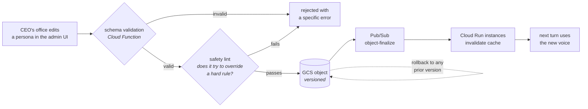

In production the file is a GCS object behind a small admin UI; the runtime watches for
change events (and falls back to an ETag poll on a 60-second loop). In the prototype the
same mechanism is an mtime watch on `config/personas/*.yaml` — edit the file, ask the
next question, hear the new voice. No restart, no deploy.

Two personas ship as a demonstration: `exec_default` (structured executive briefing) and
`ceo_q3_terse` (120-word cap, blunt, delta-first, with a banned-word list). `/persona use
ceo_q3_terse` switches mid-conversation.

The same hot-reload mechanism governs `pii_policy.yaml` (owned by Data Governance) and
the budget ceilings in `settings.yaml` (owned by whoever owns the LLM bill) — three
different teams changing three different things on their own cadence, none of them
needing an engineer.

---

## 14. Extensibility

> *Requirement: easily extendable for new capabilities and new data sources.*

**New capability — charts, email, web search.** Capabilities are tools behind a common
interface, registered at construction. Adding "render a chart" means: implement the tool,
register it, add a route branch, add eval cases. Because the graph routes on the planner's
`route` field, a new capability is a new branch rather than a rewrite. Charts specifically
would render server-side to a PNG in GCS and return a signed URL, so the model never
handles image bytes. Email would reuse the destructive-op confirmation gate — sending a
report to a distribution list is outbound and irreversible, so it gets a preview and an
explicit approval, exactly like deletion.

**New data source.** The warehouse is a `Protocol` with four methods (`estimate`,
`execute`, `schema`, `tables`). The prototype ships two implementations — BigQuery and a
local DuckDB mirror — and the agent's generated SQL runs unmodified against both, because
the adapter transpiles dialects internally. Adding Snowflake, Postgres or a REST API means
implementing that protocol and adding a semantic-layer entry. No node, prompt or edge
changes.

**New safety policy.** PII classification is data, not code. Reclassifying a column is a
YAML edit that takes effect on the next turn and is enforced identically at validation and
masking time.

---

## 15. What the prototype implements

The assignment asks the prototype to cover at least two of the listed requirements. This
one covers **all five**, plus the hybrid-intelligence and learning requirements, on a
warehouse that runs with no cloud account.

| Requirement | Status | Where |
|---|---|---|
| Safety & PII masking | **Full** — 5 layers, 43 tests | `safety/guardrail.py`, `safety/sql_guard.py`, `safety/pii.py` |
| High-stakes oversight | **Full** — two-phase, graph interrupt, token binding, soft delete, audit | `tools/report_store.py`, `nodes/reports.py` |
| Resilience & error handling | **Full** — classified repair, bounded budgets, breaker, degradation ladder | `nodes/sql.py`, `resilience/policies.py`, `llm.py` |
| Quality assurance | **Full** — 136 tests + 3 eval suites + judge harness | `tests/`, `evals/` |
| Observability | **Full** — OTel-shaped tracing, 25 metrics, `/trace` | `obs/tracing.py`, `obs/metrics.py` |
| Hybrid intelligence | **Full** — hybrid retrieval, 7 seeded trios, candidate queue | `golden/store.py`, `nodes/learn.py` |
| Learning loops | **Full** — confidence-ramped prefs, human-gated trios | `memory/user_profile.py`, `nodes/learn.py` |
| Persona agility | **Full** — hot-reloaded YAML, 2 personas | `config/personas/`, `config.py` |
| Multi-step analysis | **Full** — planner decomposes into ≤4 steps | `nodes/understand.py` |

**Both warehouse backends are verified.** The agent runs against the real
`bigquery-public-data.thelook_ecommerce` (125,262 orders, 181,225 line items, 100,000
users) through a service account holding only `roles/bigquery.jobUser` — schema reads, the
dry-run cost gate, live execution, PII masking on real rows, and the validator rejecting
writes were all exercised end to end (`scripts/verify_bigquery.py`). The least-privilege
claim in §16 is demonstrated rather than asserted: the same account attempting
`CREATE SCHEMA` receives `403 … does not have bigquery.datasets.create permission`.
A measured two-query turn billed 62.9 MB, 0.006% of the monthly free tier.

Deliberately **not** built, and why: the surrounding GCP infrastructure (Firestore,
Pub/Sub, Cloud Run, Vertex AI Vector Search) is replaced by SQLite, in-process queues and
a CLI — the interfaces are the same shape and provisioning them adds no design signal;
charts, email and web search are described as extension points rather than implemented,
because the extensibility claim is already proven by the warehouse `Protocol` having two
working implementations that run identical generated SQL.

---

## 16. Cost, scale and security posture

**Cost per turn** (Vertex pricing, 2-step analysis): ~6 Flash calls at ~4k input tokens
each plus one Pro call at ~8k input / 1k output ≈ **$0.02–0.04**. At 200 managers × 8
turns/day ≈ **$50–65/day** in inference. BigQuery is negligible on this dataset with the
dry-run gate and date filters; the semantic cache removes an estimated 25–35% of turns
outright on month-boundary traffic.

**Scale.** Cloud Run handles the concurrency trivially — the bottleneck is Gemini
throughput, addressed with provisioned throughput and a per-user token quota. Firestore
and the vector index are far below any interesting limit at this corpus size.

**Security posture.** Read-only service account; authorized views that do not expose
denied columns at all; VPC Service Controls perimeter around BigQuery and Vertex; CMEK on
Firestore and GCS; Secret Manager for all credentials with 90-day rotation; IAP-enforced
SSO with group-mapped roles; full audit log of every destructive operation and every PII
filter usage; no customer PII ever written to logs, traces or the model context.
